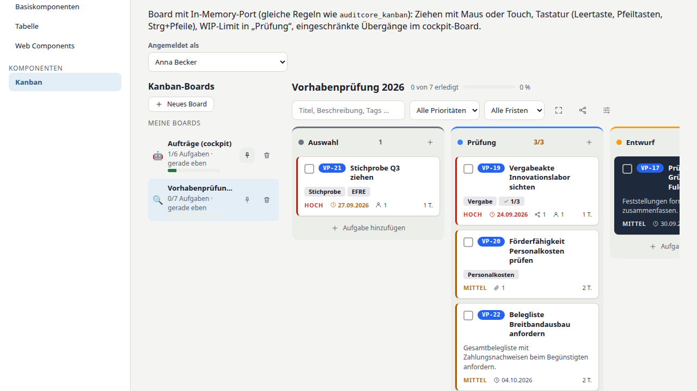
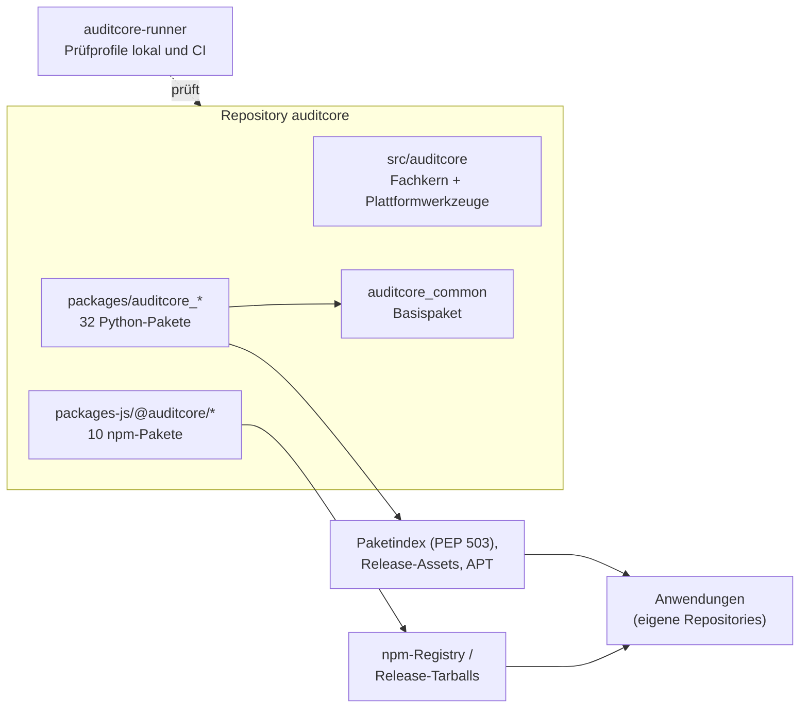

# auditcore

[](https://github.com/janpow77/auditcore/actions/workflows/quality.yml)
[](https://github.com/janpow77/auditcore/actions/workflows/domain-packages.yml)
[](https://github.com/janpow77/auditcore/actions/workflows/js-packages.yml)
[](https://github.com/janpow77/auditcore/actions/workflows/code-quality-gate.yml)

[](LICENSE)

**Plattformbibliothek zur Herstellung und Pflege eigenständiger Fachbibliotheken für Prüf-,
Kontroll- und Revisionsverfahren.** Das Repository verwaltet 42 separat installierbare
Python- und npm-Pakete; Anwendungen bleiben in ihren eigenen Repositories und beziehen
benötigte Pakete über pip, APT oder npm.

Grundlage ist das [Lastenheft](AUDITCORE_LASTENHEFT.md) mit der später ausdrücklich
vereinbarten [Mehrpaket-Architektur](docs/architecture/ADR-001-multi-package-monorepo.md).
Der [Umsetzungsplan](docs/architecture/IMPLEMENTATION_PLAN.md) verlangt zuerst das fertige
Framework und seinen technischen Nachweis, danach die Fachbibliotheken.

## Auf einen Blick

- **Fachbibliotheken für den Prüfprozess:** Vergabe- und Registerprüfung, Checklisten und BPMN,
  Stichproben und Fehlerhochrechnung (TER/RER), Schwärzung und Pseudonymisierung, Berichte.
- **Eigenständig installierbar:** Jedes Paket hat eigenes `pyproject.toml` bzw. `package.json`,
  eigene Tests und Herkunftsnachweise; kein Fachpaket benötigt die Plattform zur Laufzeit.
- **Frameworkfreie Domänenkerne:** keine Webframeworks, Datenbanken oder HTTP-Clients im
  Fachkern; Web-Adapter liegen in optionalen Extras.
- **Quality Gates mit Ratchet:** `auditcore-codegate` vergleicht Komplexität, Längen, Typisierung
  und Duplikate mit `quality/baseline.json`; kein Wert darf steigen.
- **Einheitliche Prüfbank:** `auditcore-runner` führt dieselben Prüfprofile lokal und in der CI aus.
- **Plattformwerkzeuge:** Inventur und Konsolidierung, Refactoring mit Characterization-Tests,
  Debian-/APT-Paketierung.



*Beispiel aus den Oberflächenpaketen: Kanban-Board der Komponenten-Demo (`@auditcore/ui`, Regeln aus `auditcore_kanban`).*

## Schnellstart

**Python-Bibliothek in einer Anwendung nutzen** (Python 3.11 oder neuer):

```bash
python -m pip install auditcore-geo \
  --index-url https://janpow77.github.io/auditcore/simple/
```

Hashgebundene Requirements und APT: [package-feed.md](docs/deployment/package-feed.md),
[library-installation.md](docs/deployment/library-installation.md).

**Vue, React oder Web Components** (Standardweg npm-Registry; Veröffentlichung nach jedem
Release durch den Workflow `npm-publish`):

```bash
npm install @auditcore/ui vue                     # Vue und Web Components
npm install @auditcore/ui-react react react-dom   # React, ohne Vue
```

Lauffähige Beispiele: [`examples/vue-minimal`](examples/vue-minimal),
[`examples/react-minimal`](examples/react-minimal),
[`examples/webcomponent-minimal`](examples/webcomponent-minimal).

**Am Repository entwickeln:**

```bash
python3 -m venv .venv
. .venv/bin/activate
python -m pip install -e ".[dev]"
pytest
ruff check .
mypy src
```

<details>
<summary><b>Installation ohne Registry-Zugang, npm-Entwicklung, Voraussetzungen</b></summary>

Ohne Registry-Zugang (Intranet, offline) liegen dieselben npm-Pakete als Tarballs im
Release; `npm-packages.json` nennt je Paket alle nötigen Tarball-URLs. Details,
Integritätsprüfung, `vendor/`-Ablage und REST-Gegenstellen:
[frontend-installation.md](docs/deployment/frontend-installation.md); Einrichtung der
Registry-Veröffentlichung: [npm-veroeffentlichung.md](docs/deployment/npm-veroeffentlichung.md).

```bash
BASE=https://github.com/janpow77/auditcore/releases/download/v<release>
curl -fsSLO "$BASE/npm-packages.json"
echo '@auditcore:registry=https://npm-registry.invalid/' >> .npmrc   # nie aus einer Registry
npm install $(node -e 'const m=require("./npm-packages.json");const p=m.packages.find(x=>x.name===process.argv[1]);console.log(Object.entries(p.package_json_dependencies).map(([n,u])=>n+"@"+u).join(" "))' @auditcore/ui) vue
# React: @auditcore/ui-react statt @auditcore/ui, dazu react react-dom (kein Vue)
```

npm-Pakete am Repository entwickeln (Node 20.19 oder neuer, npm-Workspaces unter `packages-js/`):

```bash
npm ci
npm run lint && npm run typecheck && npm test && npm run build
node scripts/js/verify-examples.mjs   # Beispiele aus frisch gepackten Tarballs bauen
```

Der Core benötigt nur die Standardbibliothek. Extras: `quality`, `analysis`, `deploy`, `all`.
GitHub-Zugriff nutzt eine bereits angemeldete `gh`-CLI. Debian-Builds benötigen `dpkg-deb`;
isolierte Pakettests benötigen Docker auf **dem Buildsystem**, nicht auf dem Zielserver.

</details>

## Architektur



| Bereich | Aufgabe |
|---|---|
| `auditcore` | Fachmodelle, versionierte Regeln, Provenienz, Reporting |
| `auditcore.tools.quality` | Deterministische technische Quality Gates |
| `auditcore.tools.consolidator` | Inventur, Vergleich, Kandidaten, Pläne |
| `auditcore.tools.apprefactor` | Characterization, Migration, Wrapper, Verifikation |
| `auditcore.tools.deployer` | Build, Debian, Pakettests, signierte APT-Metadaten |

Der Fachkern importiert keine Tools, Webframeworks, HTTP-Clients oder Datenbanken. Neue
Fachbibliotheken erhalten eigene Distributionen unter `packages/` und keine automatische
Laufzeitabhängigkeit von der Plattform oder anderen Fachpaketen. Die vorhandene Funktion
`auditcore.reporting.get_number_format` wurde mit 34 Characterization-Fällen aus Flowlib
übernommen; Herkunft und MIT-Lizenz stehen unter [`docs/provenance`](docs/provenance) und
[`LICENSES`](LICENSES). Verzeichnisstruktur und Modulkarte: [ARCHITEKTUR.md](ARCHITEKTUR.md).

## Fachliche Anwendungsbereiche

Welche Pakete für welche Phase von Prüfungs-, Kontroll- und Revisionsverfahren gedacht sind:

| Phase / Anwendungsbereich | Typische Prüfungsaufgabe | Maßgebliche Bibliotheken |
|---|---|---|
| **1. Recherche, Vergabe & Compliance** | Vorabprüfung von Vergaben, Schwellenwerten, Sanktionen, De-minimis-Beihilfen und Unternehmensidentitäten. | [`auditcore_procurement`](packages/auditcore_procurement), [`auditcore_funding_sources`](packages/auditcore_funding_sources), [`auditcore_registry_sources`](packages/auditcore_registry_sources), [`auditcore_legal_sources`](packages/auditcore_legal_sources), [`auditcore_price_sources`](packages/auditcore_price_sources), [`auditcore_property_sources`](packages/auditcore_property_sources), [`auditcore_entity_matching`](packages/auditcore_entity_matching), [`auditcore_risk`](packages/auditcore_risk), [`auditcore_geo`](packages/auditcore_geo) |
| **2. Checklisten & Verfahrensprüfung** | Abbildung hierarchischer Prüfpfade, Vor-Ort-Fragebögen, Abgleich von Richtlinien und Modellierung von Kontrollsystemen. | [`auditcore_checklists`](packages/auditcore_checklists), [`auditcore_documents`](packages/auditcore_documents), [`auditcore_bpmn`](packages/auditcore_bpmn), [`@auditcore/bpmn-editor`](packages-js/bpmn-editor), [`@auditcore/bpmn-vue`](packages-js/bpmn-vue), [`@auditcore/bpmn-react`](packages-js/bpmn-react) |
| **3. Stichproben & Prüfstatistik** | Ziehung von Stichproben (MUS/Zufall), statistische Anomalieprüfung (Benford) und Fehlerhochrechnung (TER/RER) nach EU-Leitfaden. | [`auditcore_sampling`](packages/auditcore_sampling), [`auditcore_statistics`](packages/auditcore_statistics), [`auditcore_extrapolation`](packages/auditcore_extrapolation), [`auditcore_market_indicators`](packages/auditcore_market_indicators), [`auditcore_price_analysis`](packages/auditcore_price_analysis) |
| **4. Datenschutz, Schwärzung & Testdaten** | Revisionssichere PDF-Schwärzung vor Akteneinsicht, Scoped-Pseudonymisierung, VVT/DSFA und geschützte synthetische Testdaten. | [`auditcore_pdf`](packages/auditcore_pdf), [`auditcore_privacy`](packages/auditcore_privacy), [`auditcore_dataprotection`](packages/auditcore_dataprotection), [`auditcore_dummygenerator`](packages/auditcore_dummygenerator), [`auditcore_invoicegenerator`](packages/auditcore_invoicegenerator), [`auditcore_invoicesynth`](packages/auditcore_invoicesynth) |
| **5. Berichtswesen, Plattform & UI** | Revisionssichere Word-/Excel-/PDF-Berichte, Prüfungs-Kanban, gemeinsame Mandanten-/Kontoverwaltung und UI-Kerne. | [`auditcore_reporting`](packages/auditcore_reporting), [`auditcore_kanban`](packages/auditcore_kanban), [`@auditcore/kanban-core`](packages-js/kanban-core), [`auditcore_account`](packages/auditcore_account), [`auditcore_auth`](packages/auditcore_auth), [`auditcore_identifiers`](packages/auditcore_identifiers), [`auditcore_harvest`](packages/auditcore_harvest), [`auditcore_llm_client`](packages/auditcore_llm_client), [`@auditcore/ui`](packages-js/ui), [`@auditcore/layout`](packages-js/layout) |

## Pakete

Alle Python-Pakete liegen unter `packages/`, die npm-Pakete unter `packages-js/`. Jedes wird
aus eigenem `pyproject.toml` bzw. `package.json` gebaut und hat eigene Tests,
Anwendbarkeitskontexte und Herkunftsnachweise; jede Paket-README folgt der
[README-Vorlage](docs/bibliotheken/readme-vorlage.md). Synthetische Testrechnungen sind keine
Zusage eines Systems zur verbindlichen Rechnungsstellung.

<details>
<summary><b>Paketkatalog: Version, Zweck, Abhängigkeiten, Status (42 Pakete)</b></summary>

Die Tabelle wird aus `pyproject.toml`, `package.json`, dem Abschnitt „Zweck“ der
Paket-README und `provenance.json` erzeugt.

<!-- paketkatalog:start (generiert: python scripts/docs/catalog.py --write) -->
46 Pakete, gruppiert nach Einordnung ([Übersicht](docs/bibliotheken/uebersicht.md)):

**Querschnitt**

| Paket | Version | Zweck | Abhängigkeiten | Status |
|---|---|---|---|---|
| [`auditcore_auth`](packages/auditcore_auth) | 0.1.2 | Passwort-Hashing mit benannten Profilen (bcrypt, argon2id) und JWT-Ausstellung/-Prüfung über PyJWT, mit Kompatibilitätsprofilen, unter denen bisherige Hashes und Token der Anwendungen gültig bleiben. | keine; Extras: `bcrypt`, `argon2`, `jwt`, `fastapi` | neu, gegen charakterisierte Verträge |
| [`auditcore_common`](packages/auditcore_common) | 0.2.1 | Gemeinsame Hilfsfunktionen der auditcore-Fachpakete und Anwendungen (JSON, Hashing, Profile, sicheres XML, HTML-Links, Numerik, Zahleneingabe, Dateinamen, Event-Loop), zusammengeführt nur mit Gleichheitsbeweis gegen jede Paketkopie. | keine; Extras: `xml` | konsolidiert (Gleichheitsnachweis) |
| [`auditcore_flow_agent`](packages/auditcore_flow_agent) | 0.1.0 | Dauerhafte Auftragswarteschlange, kapazitätsabhängige Rechnerwahl und überwachte Prozessausführung als eigenständig installierbare Bibliothek für Flow-Agent. | `auditcore_common==0.2.1` | neu, gegen charakterisierte Verträge |
| [`auditcore_harvest`](packages/auditcore_harvest) | 0.1.4 | Gemeinsamer, frameworkunabhängiger Kern für Datenharvester: Quellenvertrag, Abruf mit Pagination, Zeitgrenzen, Rate-Limits und begrenzten Wiederholungen, Dubletten, idempotente Übergabe an eine Senke und Checkpoints. | `auditcore_common==0.2.1`; Extras: `xml` | neu, gegen charakterisierte Verträge |
| [`auditcore_identifiers`](packages/auditcore_identifiers) | 0.2.1 | Prüfen und Normalisieren von Kennungen – IBAN, BIC, USt-IdNr. (alle EU-Staaten), Steuer-ID, Steuernummer, LEI und Handelsregisternummer – mit einheitlichem Ergebnisobjekt und benannten Profilen. | `auditcore_common==0.2.1`; Extras: `web`, `fastapi` | neu, gegen charakterisierte Verträge |
| [`auditcore_llm_client`](packages/auditcore_llm_client) | 0.1.3 | Client für den ai-router und das Flow-Agent-Inferenz-Gateway: Chat, Streaming, Embeddings, Rerank, OCR und Health, mit Schwärzung, Wiederholungen und Circuit-Breaker. | keine; Extras: `http` | neu, gegen charakterisierte Verträge |

**Fachbibliotheken**

| Paket | Version | Zweck | Abhängigkeiten | Status |
|---|---|---|---|---|
| [`auditcore_account`](packages/auditcore_account) | 0.1.1 | Gemeinsame Konten, Mandanten, Corporate Design und administrative Zugangsabläufe mit einem Formularvertrag für Vue und React. | `auditcore_auth==0.1.2`; Extras: `images`, `passwords` | neu |
| [`auditcore_bpmn`](packages/auditcore_bpmn) | 0.1.3 | BPMN 2.0 mit der FlowAudit-Erweiterung (Schema 1.1) sicher lesen, prüfen, vergleichen, neutralisieren und berichten – für Prozessdiagramme von Verwaltungs- und Kontrollsystemen aller Fonds mit geteilter Mittelverwaltung. | keine; Extras: `xml`, `excel`, `pdf`, `legal` | spezifiziert |
| [`auditcore_checklists`](packages/auditcore_checklists) | 0.1.0 | Checklisten-Kern: hierarchische Prüfbäume, Antwort- und Auswertungsvertrag sowie portabler Paketaustausch für strukturierte Prüfungsabläufe. | `auditcore_common==0.2.1` | neu |
| [`auditcore_compute`](packages/auditcore_compute) | 0.1.0 | Deterministische Rechenkerne für Prüfdaten: optionale Numba-Kompilierung, NumPy-Rückfall für elementweise Prüfungen, centgenaue Quoten und Zinsen, Plausibilitätsprüfungen und kompensierte Statistik. | `numpy>=1.24`; Extras: `jit` | neu, gegen charakterisierte Verträge |
| [`auditcore_dataprotection`](packages/auditcore_dataprotection) | 0.5.2 | Frameworkunabhängige Bibliothek, mit der Anwendungen eigene Verzeichnisse von Verarbeitungstätigkeiten (VVT) und Datenschutz-Folgenabschätzungen (DSFA) anlegen, berechnen, versionieren, freigeben und ausgeben. | `auditcore_common==0.2.1`; Extras: `excel`, `pdf`, `web`, `fastapi` | spezifiziert |
| [`auditcore_documents`](packages/auditcore_documents) | 0.6.0 | Dokumentvergleich (Checklisten und Fließtext aus DOCX/PDF), Gesetzessynopse für Artikelgesetze und ein frameworkunabhängiger Kern der Dokumentpipeline mit OCR-Ports. | `auditcore_common==0.2.1`, `auditcore_identifiers==0.2.1`; Extras: `docx`, `pdf-text`, `fuzzy`, `docx-render`, `pdf-render`, `mime`, `ocr-raster`, `donut`, `web`, `fastapi` | spezifiziert |
| [`auditcore_dummygenerator`](packages/auditcore_dummygenerator) | 0.1.4 | Frameworkunabhängiger Generator für synthetische Testdaten: einzelne Felder (Namen, Adressen, Kennungen, Beträge, Datumswerte) und ganze Zeilen mit festem Seed und Bezugsdatum. | keine; Extras: `parallel` | spezifiziert |
| [`auditcore_entity_matching`](packages/auditcore_entity_matching) | 0.2.5 | Nachvollziehbare Normalisierung von Firmen- und Personennamen nach benannten, versionierten Profilen, LEI-Prüfung nach ISO 17442 und transparente unscharfe Abgleiche. | `auditcore_common==0.2.1`; Extras: `fuzzy` | spezifiziert |
| [`auditcore_extrapolation`](packages/auditcore_extrapolation) | 0.2.0 | Hochrechnung von Stichprobenfehlern für Prüfbehörden nach dem KOM-Leitfaden zur Stichprobenziehung: Präzision, Fehlerobergrenze, Gesamtfehlerquote (TER) und getrennt davon die Restfehlerquote (RER). | `auditcore_common==0.2.1`; Extras: `web` | neu |
| [`auditcore_geo`](packages/auditcore_geo) | 0.3.2 | Charakterisierter Geokern ohne Fremdabhängigkeiten: Großkreisentfernung mit ausdrücklichem Erdmodell, Umkreissuche, Punkt in Fläche mit erkanntem Rand, UTM, GeoPackage-Polygone und Douglas-Peucker. | `auditcore_common==0.2.1`; Extras: `geocoder`, `web`, `fastapi` | spezifiziert |
| [`auditcore_invoicegenerator`](packages/auditcore_invoicegenerator) | 0.2.4 | Synthetische Testrechnungen mit vollständigen Parteien, Positionen, Beträgen und Datumsfeldern, expliziten Fehlerfällen und einem charakterisierten historischen Flowinvoice-Profil; JSON-Ausgabe, PDF optional. | `auditcore_dummygenerator==0.1.4`; Extras: `pdf` | spezifiziert |
| [`auditcore_invoicesynth`](packages/auditcore_invoicesynth) | 0.2.1 | Synthetische Trainings- und Testdaten für eine Donut-basierte Erkennung deutscher und österreichischer Rechnungen: Rechnungsbilder, Ziel-JSON, Manifest mit Datensatz-Hash und Bewertung. | `auditcore_common==0.2.1`, `auditcore_invoicegenerator==0.2.4`; Extras: `render`, `train` | neu |
| [`auditcore_kanban`](packages/auditcore_kanban) | 0.1.3 | Framework-freies Kanban-Domänenmodell mit Rang-Schlüsseln, Übergangsregeln, WIP-Limits, Rechten, Ereignisprotokoll und einem REST-Vertrag für die Anwendungen der FlowAudit-Familie. | keine; Extras: `ui`, `fastapi` | neu, gegen charakterisierte Verträge |
| [`auditcore_market_indicators`](packages/auditcore_market_indicators) | 0.1.4 | Technische Marktindikatoren (Renditen, SMA/EMA, RSI, ATR, ADX, MACD, Volatilität, Z-Score, Breakout) auf einfachen Zahlenfolgen, mit ausdrücklich gewählten, quellengebundenen Profilen. | `auditcore_common==0.2.1`; Extras: `polars` | neu, gegen charakterisierte Verträge |
| [`auditcore_officebank`](packages/auditcore_officebank) | 0.1.0 | Prüfbank für Office-Makroprojekte (Excel, Access, Word): Konfiguration, Gates, Steuerung einer Windows-VM, Build aus Commits, Abnahme gegen Sollwerte und datenfreie Lieferpakete. | keine; Extras: `docx`, `xlsx` | neu, gegen charakterisierte Verträge |
| [`auditcore_pdf`](packages/auditcore_pdf) | 0.1.0 | Vollständige PDF-Verarbeitung, Seitenoperationen, visuelle Anzeige und nachprüfbare Schwärzung für Prüf- und Kontrollprozesse. | `auditcore_common==0.2.1`; Extras: `pymupdf`, `pillow` | neu |
| [`auditcore_price_analysis`](packages/auditcore_price_analysis) | 0.1.4 | Exakte Jahreskostenberechnung für regulierte Tarife (Nahwärme, Wasser mit Staffeln), deterministische Tarifauswahl und Vergleichsregeln (Abweichung, Ampel, Gruppenstatistik) auf versionierten, quellengebundenen Profilen. | `auditcore_common==0.2.1` | spezifiziert |
| [`auditcore_privacy`](packages/auditcore_privacy) | 0.1.0 | Deterministische, kollisionsfreie Pseudonymisierung, Maskierung und Scoped-Zuordnungsverwaltung für Prüf- und Kontrollprozesse. | `auditcore_common==0.2.1` | neu, gegen charakterisierte Verträge |
| [`auditcore_procurement`](packages/auditcore_procurement) | 0.2.5 | Vergabebekanntmachungen (TED, HAD) als kanonischer Datensatz mit verhaltensgleicher TED-Normalisierung und Dateiimport sowie deterministische, versionierte Vergabe-Vorprüfungen mit EU-Schwellenwerten je Geltungszeitraum. | `auditcore_common==0.2.1`; Extras: `html`, `sources` | spezifiziert |
| [`auditcore_reporting`](packages/auditcore_reporting) | 0.3.1 | Charakterisierte Flowlib-Zahlenformate für Berichte (Spaltenname → Excel-Zahlenformat) mit benannten Formatprofilen, optionalem, abgesichertem XLSX-Export und versionierten Berichtsvorlagen (DOCX, PDF, HTML). | `auditcore_common==0.2.1`; Extras: `excel`, `docx`, `pdf`, `web`, `fastapi` | spezifiziert |
| [`auditcore_risk`](packages/auditcore_risk) | 0.4.0 | Risiko-Merkmale (Red Flags) aus ausdrücklich gewählten, versionierten und quellengebundenen Regelprofilen, jedes Merkmal mit Code, Begründung, Belegwerten und Quellfundstelle. | `auditcore_common==0.2.1`, `auditcore_compute==0.1.0`, `auditcore_entity_matching==0.2.5`, `numpy>=1.24`; Extras: `fuzzy`, `pandas`, `procurement`, `web`, `fastapi` | spezifiziert |
| [`auditcore_runner`](packages/auditcore_runner) | 0.1.0 | Ephemere self-hosted GitHub-Runner auf eigenen Rechnern – isoliert, dynamisch nach Last skaliert – und eine lokale Prüfbank mit einheitlichen, baseline-gefilterten Befunden. | keine; Extras: `github-app`, `workflows` | neu |
| [`auditcore_sampling`](packages/auditcore_sampling) | 0.2.4 | Stichprobenumfänge (MUS, einfache Zufallsstichprobe), systematische MUS-Auswahl, Zufallsauswahl und Schichtung mit ausdrücklich benannten, quellengebundenen Methoden. | `auditcore_common==0.2.1`; Extras: `web` | spezifiziert |
| [`auditcore_statistics`](packages/auditcore_statistics) | 0.3.5 | Beschreibende Prüfstatistik (Benford-Test erster und erster zwei Ziffern, Konformitätsmaße nach MAD und z-Test) mit benannten, quellengebundenen Methodenprofilen. | `auditcore_common==0.2.1`; Extras: `web` | spezifiziert |
| [`auditcore_tyfindings`](packages/auditcore_tyfindings) | 0.2.0 | Types of Findings 2021–2027 für Feststellungen der EFRE-Verwaltungsprüfungen: versionierter Katalog, Zuordnung der Fehlerkennziffern mit Schlüsselwortregeln und Gold-plating-Kennzeichen. | `auditcore_common==0.2.1` | charakterisiert |

**Quellen-Adapter**

| Paket | Version | Zweck | Abhängigkeiten | Status |
|---|---|---|---|---|
| [`auditcore_funding_sources`](packages/auditcore_funding_sources) | 0.1.6 | Quellenprofile für Fördertransparenz, Beihilfen und das zentrale De-minimis-Register: Parser, stabile Identitäten, Bestandssemantik der Harvest-Modi, Registerabgleich und eine versionierte De-minimis-Kumulierung. | `auditcore_common==0.2.1`, `auditcore_harvest==0.1.4`; Extras: `xlsx` | spezifiziert |
| [`auditcore_legal_sources`](packages/auditcore_legal_sources) | 0.1.6 | Quellenadapter für Rechts-, Parlaments- und Prüfquellen – Bundestag DIP, EUR-Lex/Cellar, BaFin, CURIA und Europäischer Rechnungshof – mit strikter Antwortprüfung und Normalisierung zu `LegalDocument`. | `auditcore_common==0.2.1`, `auditcore_harvest==0.1.4`; Extras: `feeds` | spezifiziert |
| [`auditcore_price_sources`](packages/auditcore_price_sources) | 0.1.4 | Preis- und Marktdatenquellen (Bundesbank, Destatis GENESIS, EIA, Tankerkönig, Overpass, EU Oil Bulletin) als Adapter auf `auditcore_harvest`, mit Einheit, Zeitbezug und Wertstatus je Datensatz. | `auditcore_common==0.2.1`, `auditcore_harvest==0.1.4` | neu, gegen charakterisierte Verträge |
| [`auditcore_property_sources`](packages/auditcore_property_sources) | 0.1.4 | Getrennte Quellprofile für Immobiliendaten – Berliner und französische Mietportale sowie Zwangsversteigerungen des ZVG-Portals – mit Harvest-Adaptern, reinem ZVG-Lebenszyklus und Zugangskatalog. | `auditcore_common==0.2.1`; Extras: `sources` | spezifiziert |
| [`auditcore_registry_sources`](packages/auditcore_registry_sources) | 0.2.4 | Register-, Sanktions- und PEP-Quellen mit quellengebundenen Profilen: Listenformate lesen, Listen über `auditcore_harvest` abrufen, Namen abgleichen, Firmendaten prüfen und Screening-Treffer nachvollziehbar entscheiden. | `auditcore_common==0.2.1`, `auditcore_harvest==0.1.4`, `auditcore_entity_matching==0.2.5`; Extras: `fuzzy`, `xml`, `html`, `web`, `fastapi` | spezifiziert |

**Oberfläche und Frontend-Logik (npm)**

| Paket | Version | Zweck | Abhängigkeiten | Status |
|---|---|---|---|---|
| [`@auditcore/bpmn-editor`](packages-js/bpmn-editor) | 0.1.2 | Eigener, vollständiger BPMN-2.0-Zeicheneditor in TypeScript auf Basis von diagram-js und bpmn-moddle, framework-frei und unter MIT-Lizenz. | `bpmn-moddle@^10.3.1`, `diagram-js@^15.27.1`, `didi@^11.0.0`, `min-dash@^5.1.0`, `min-dom@^5.3.0`, `tiny-svg@^4.1.4` | neu |
| [`@auditcore/bpmn-flowaudit`](packages-js/bpmn-flowaudit) | 0.5.0 | Framework-freie FlowAudit-Fachschicht für den BPMN-Editor: Schema flowaudit 1.0/1.1, Rollen, Kennzeichen, Prüfbezüge, Prüfregeln, Anreicherung, Neutralisierung, Vergleiche, Durchlauftest, Berichte und Export. | `bpmn-moddle@^10.3.1`, `@auditcore/bpmn-editor@^0.1.1` (peer) | neu |
| [`@auditcore/bpmn-react`](packages-js/bpmn-react) | 0.5.0 | Native React-Oberfläche des FlowAudit-BPMN-Editors für React 18.3 und 19 – ohne Vue-Laufzeit und ohne Web Components, auf demselben framework-freien Kern wie `@auditcore/bpmn-vue`. | `@auditcore/bpmn-editor@0.1.2`, `@auditcore/bpmn-flowaudit@0.5.0`, `@auditcore/ui-core@0.3.0`, `react@^18.3.0 || ^19.0.0` (peer), `react-dom@^18.3.0 || ^19.0.0` (peer) | neu |
| [`@auditcore/bpmn-vue`](packages-js/bpmn-vue) | 0.5.0 | Vue-3-Oberfläche des FlowAudit-BPMN-Editors mit Eigenschaften-Panel, Sammlung, Prüfansichten und Export – als Vue-Bibliothek, Web Component `<flowaudit-bpmn-editor>` und eigenständige App. | `@auditcore/bpmn-editor@0.1.2`, `@auditcore/bpmn-flowaudit@0.5.0`, `@auditcore/ui-core@0.3.0`, `vue@^3.5.0` (peer) | neu |
| [`@auditcore/common`](packages-js/common) | 0.1.1 | Framework-freie Hilfsfunktionen der FlowAudit-Anwendungen in TypeScript: deutsche Formatierung in Berliner Zeit, strikte Zahleneingabe, API-Fehlertexte, REST, Token, CSV, Zeitsteuerung, Sortierung und Prüfziffern. | keine | neu |
| [`@auditcore/kanban-core`](packages-js/kanban-core) | 0.2.1 | Framework-freie Kanban-Logik in TypeScript mit denselben Regeln wie das Python-Paket `auditcore_kanban`: Rang-Schlüssel, Übergänge, WIP-Limits, Filter, Fristen, Rechte, Validierung und reine Befehle. | keine | neu |
| [`@auditcore/layout`](packages-js/layout) | 0.1.0 | Wiederverwendbare Seitenlayouts und Oberflächenelemente für FlowAudit-Anwendungen mit Vue, Web Components, Hell-/Dunkelmodus, Login-Animationen und Exportaktionen. | `@auditcore/ui@0.4.0`, `vue@^3.5.0` (peer) | neu |
| [`@auditcore/ui`](packages-js/ui) | 0.4.0 | Gemeinsame Oberflächenkomponenten der FlowAudit-Anwendungen als Vue-3-Komponenten und Web Components, mit Designtoken, Hell-/Dunkelmodus und Sprachunterstützung. | `@auditcore/common@0.1.1`, `@auditcore/kanban-core@0.2.1`, `@auditcore/ui-core@0.3.0`, `vue@^3.5.0` (peer) | neu |
| [`@auditcore/ui-core`](packages-js/ui-core) | 0.3.0 | Framework-freier Kern der FlowAudit-Oberflächen: Texte, Datentypen der REST-Verträge, View-Modelle, Zustandsautomaten, Ports, Exporte und Stile – gemeinsam für Vue und React. | `@auditcore/common@0.1.1`, `@auditcore/kanban-core@0.2.1`, `leaflet@^1.9.4` | neu |
| [`@auditcore/ui-react`](packages-js/ui-react) | 1.2.0 | Native React-Komponenten (React 18/19) der FlowAudit-Oberflächen von Tabelle bis Kanban – ohne Vue, auf den Kernen `@auditcore/ui-core` und `@auditcore/kanban-core`. | `@auditcore/common@0.1.1`, `@auditcore/ui-core@0.3.0`, `@auditcore/kanban-core@0.2.1`, `react@^18.3.0 || ^19.0.0` (peer), `react-dom@^18.3.0 || ^19.0.0` (peer) | neu |
<!-- paketkatalog:end -->

</details>

Der aktuelle [Pre-release v0.8.1](https://github.com/janpow77/auditcore/releases/tag/v0.8.1)
bündelt 35 Python-Bibliotheken und 10 npm-Pakete: Wheels, Source-Distributionen,
signierte Debian-Pakete und npm-Tarballs mit `npm-packages.json`.
Installationshinweise und Prüfnachweise stehen in der [Paketquellen-Anleitung](docs/deployment/package-feed.md). Der Paketindex `https://janpow77.github.io/auditcore/simple/` verlinkt
alle Versionen mit SHA-256. Weiteres: [vollständiger Paketbericht](docs/reports/DOMAIN_PACKAGES_REPORT.md),
[Paketgrenzen und weitere Kandidaten](docs/architecture/DOMAIN_PACKAGE_PLAN.md),
technischer Frameworknachweis im [Phasenbericht](docs/reports/FRAMEWORK_PHASES_1_2.md).

## Qualitäts- und Architekturvorgaben

Alle Bibliotheken unterliegen verbindlichen Qualitäts- und Architekturstandards und werden vor
jedem Commit und in der CI durch den `auditcore-runner` geprüft. Die Prüfprofile (`pr`, `pdf`,
`checklists`, `privacy` u. a.) stehen in `.auditcore-runner.toml`.

```bash
auditcore-runner lokal --pfad . pr --host --ohne-cache   # Prüfprofil ausführen
auditcore-runner befunde                                 # einheitlicher Befundbericht
auditcore-codegate check                                 # Pflicht-Gate Code-Qualität (Ratchet)
```

<details>
<summary><b>auditcore-runner: lokale Prüfbank und CI-Parität</b></summary>

Der `auditcore-runner` ([`packages/auditcore_runner`](packages/auditcore_runner)) ist das
verbindliche Prüfwerkzeug für Entwickler, CI-Pipelines und KI-Coding-Agents:

- **Identische Laufzeitbedingungen:** Lokale Prüfläufe laufen im selben Image und mit denselben
  Werkzeugversionen wie die CI.
- **Zentrale Befehle:**
  - `auditcore-runner lokal --pfad . <profil> --host --ohne-cache`: führt das definierte
    Prüfprofil (z. B. `pdf`, `checklists`, `privacy`, `pr`) aus.
  - `auditcore-runner befunde`: gibt den einheitlichen, maschinenlesbaren Befundbericht aus.
  - `auditcore-runner runner install`: installiert ephemere GitHub-Actions-Runner auf eigenen
    Servern (isoliert über Docker und systemd), siehe
    [self-hosted-runner.md](docs/deployment/self-hosted-runner.md).
- **Git-Inhalts-Cache:** Werkzeuge prüfen nur Dateien, deren Git-Inhalt sich seit dem letzten
  Lauf geändert hat.
- **Autofix-Vorlauf:** Sichere Formatierer und Regelfixe laufen vor der Modell- und
  Entwicklerarbeit.

</details>

<details>
<summary><b>Clean Domain Architecture (Framework-Freiheit)</b></summary>

Alle Fachpakete (`packages/auditcore_*`) sind reine Domänenkerne:

- **Keine relationale Datenbankbindung:** Kein SQLAlchemy, kein SQLModel, keine
  Datenbanktreiber im Domänenkern.
- **Keine Webframework-Kopplung:** Weder FastAPI noch Starlette dürfen im Fachkern importiert
  werden. Web- und REST-Adapter liegen in optionalen Extras oder Verbraucheranwendungen.
- **Hierarchische Abhängigkeiten:** Abhängigkeiten fließen ausschließlich von den Fachpaketen zu
  Basispaketen wie `auditcore_common`, niemals zyklisch; die
  [Mehrpaket-Verwaltung](docs/workspace.md) meldet Laufzeitzyklen.
- **Deterministische Datenverträge:** Strukturierte JSON-Schemas, kanonische Serialisierung und
  reproduzierbare SHA-256-Strukturprüfsummen.

</details>

<details>
<summary><b>Qualitäts-Ratchet und Quality Gates</b></summary>

Das Qualitäts-Gate `auditcore-codegate check` misst je Paket und vergleicht per Ratchet mit
`quality/baseline.json`. Kein Wert darf steigen; Verbesserungen werden im selben PR mit
`--update-baseline` festgeschrieben. CI-Job, pre-commit-Hook und Release-Blocker:
[Code-Qualitätsmaßstäbe](docs/quality/code-quality.md).

- **McCabe-Zyklomatische Komplexität:** maximal **10** je Funktion.
- **Funktionslänge:** maximal **60 Zeilen** je Funktion.
- **Modullänge:** maximal **400 Zeilen** je Modul.
- **Strict Typing:** striktes mypy (`--strict`) ohne `typing.Any`.
- **Englische Bezeichner;** bei `packages-js/` zusätzlich Dateigrößen und `eslint-disable`.
- **AST-Duplikatsinventur:** `duplicate_functions = 0` (wiederholte Logik muss in
  `auditcore_common` konsolidiert werden).
- **Sprach- und Rechtschreibstandard:** fachliches Deutsch mit echten Umlauten (ä, ö, ü, ß;
  keine ASCII-Ersatzschreibweisen in Texten und Docstrings).
- **Lückenlose Provenienz:** Jedes Paket führt eine maschinenlesbare `provenance.json` mit
  Herkunftsnachweis, Lizenz und Charakterisierung.
- **Dokumentationsstandard:** Alle Paket-READMEs folgen der Vorlage
  [`docs/bibliotheken/readme-vorlage.md`](docs/bibliotheken/readme-vorlage.md) und enthalten
  lauffähige Schnellstart-Codeblöcke, die `tests/test_readmes.py` bei jedem Lauf ausführt.

Technische Quality Gates der Plattform:

```bash
auditcore-quality src/auditcore --strict --context contexts/core.json --format json --output core.json
auditcore-bibquality src/auditcore/tools/quality
auditcore-bibquality src/auditcore/tools/consolidator
auditcore-bibquality src/auditcore/tools/apprefactor
auditcore-bibquality src/auditcore/tools/deployer
auditcore-quality src/auditcore --api-snapshot api.json
auditcore-quality src/auditcore --compare-api api.json
```

`auditcore-bibquality` ist ein Alias. `--no-external-tools` markiert Ruff, Mypy, Bandit und
pip-audit als NOT_EXECUTED. Konfiguration steht unter `[tool.auditcore-bibquality]` in
`pyproject.toml`; Ignore-Kommentare werden sichtbar protokolliert. Core und Tool-Komponenten
haben getrennte Prüfumfänge. [Status- und Exitcode-Semantik](docs/quality-semantics.md).

</details>

## Plattformwerkzeuge

Die Plattformdistribution `auditcore` installiert unter anderem die Befehle `auditcore-quality`,
`auditcore-codegate`, `auditcore-consolidate`, `auditcore-refactor` und `auditcore-deploy`.

<details>
<summary><b>Framework und Anwendbarkeit</b></summary>

`GitFrameworkPolicyProvider` liest `janpow77/verwaltung-app-framework` am dokumentierten
Git-Commit. Matrix, Prüfkatalog, Standardsregister und Security-Dokumente bleiben externe
Quelle. Die lokale Adapterdatei enthält technische Auslöser und Quellhashes, keinen
unabhängigen Anforderungskatalog. Bei Drift bleibt die Bewertung REVIEW_REQUIRED.

`auditcore-context.json` beschreibt die gesamte Plattformdistribution. `contexts/*.json` trennt
Core und ausführbare Werkzeuge; `--context contexts/consolidator.json` wählt den
Artefaktkontext. Unbestimmter Schutzbedarf und KI-Einsatz bleiben UNKNOWN. MUSS verlangt
Klärung; BEDINGT prüft den konkreten Auslöser; SOLL bleibt eine Empfehlung. Profile sind nur
abgeleitete Gruppierungen. Eine genehmigte Abweichung benötigt einen vollständigen zuständigen
menschlichen Entscheidungsnachweis. Der Provider selbst stellt diesen niemals aus. Cache:
`.auditcore/framework-cache.json`; offline oder bei unterschiedlichem Remote-Commit immer
POLICY_SOURCE_STALE.

Nachweise werden je Projekt aus `.auditcore/policy-evidence.json` und
`.auditcore/policy-decisions.json` geladen, jeweils nach Requirement-ID. Technische Nachweise
brauchen `status: VERIFIED`, prüfbare `references` und den aktuellen Framework-`source_commit`
sowie übereinstimmende `artifact`, `artifact_source_digest` und `context_digest`.
`evidence_binding()` berechnet nur die Bindung und erteilt keine Freigabe. Geänderte
Quellen/Kontexte und Belege anderer Pakete werden abgelehnt. `versioned_artifact_types`
unterscheidet etwa Regelwerke, Prompts und Agenten für die konkrete Testanwendbarkeit.
Abweichungen benötigen zusätzlich die menschlichen Entscheidungsfelder aus dem Policy-Modell.
Unbelegte Selbsterklärungen sind keine Freigabe. Für den Handoff muss
`auditcore-deployment-evidence.json` alle Betriebsprüfungen mit `status`, `reference`, `reason`
und den aktuellen `source_digest` enthalten. Handoff und Paketplan kontrollieren diesen erneut.

</details>

<details>
<summary><b>Inventur und Konsolidierung (<code>auditcore-consolidate</code>)</b></summary>

```bash
auditcore-consolidate inventory --global
auditcore-consolidate inventory --update
auditcore-consolidate libraries
auditcore-consolidate analyse /path/to/application --with-auditcore
auditcore-consolidate migrate owner/repository:symbol --dry-run
auditcore-consolidate status
auditcore-consolidate packages inventory .
auditcore-consolidate packages status .
```

GLOBAL inventarisiert den authentifizierten Account einschließlich privater, archivierter,
Fork- und Organisations-Repositories. Die strukturelle Analyse liest Python per AST und
Dependency-Manifeste als Daten. Sie importiert keinen fremden Code. Unveränderte Commitstände
werden wiederverwendet. Das lokale Inventar liegt atomar und mit Dateimodus 0600 unter
`.auditcore/inventory`. Leere/ausgeschlossene Repositories und Parsefehler erhalten explizite
Gründe.

REPO ist für lokale UI/API-Arbeiten, REPO_AUDITCORE für Fachlogik und GLOBAL für die
Gesamtlandschaft gedacht. Die konservative automatische Moduswahl nutzt bei Unklarheit
REPO_AUDITCORE. Der Consolidator erzeugt Pläne und verändert keine
Anwendungsimplementierungen. AST-Gleichheit ersetzt keine fachliche Freigabe. Abweichende
Regeln oder Sicherheitsgrenzen erzeugen Entscheidungsbedarf.

Die [Mehrpaket-Verwaltung](docs/workspace.md) liest `auditcore-workspace.toml` und die einzelnen
`pyproject.toml`-Dateien, ohne deren Code oder Build-Backends auszuführen. Sourcehash, API,
Abhängigkeiten, Herkunft, bekannte Consumer und Anwendbarkeitskontext werden pro Distribution
persistent erfasst. CURRENT heißt aktueller Inventarstand, nicht Policy- oder Releasefreigabe.

</details>

<details>
<summary><b>KIRA und Graphify</b></summary>

```bash
export KIRA_MEMORY_URL='https://your-approved-endpoint/api/memory'
# MEMORY_API_KEY über Secret Store/Umgebung bereitstellen, nicht hier eintragen.
auditcore-consolidate kira sync
auditcore-consolidate kira search "Dokumentenparser"
auditcore-consolidate graphify /path/to/repository
```

KIRA nutzt den bestehenden Memory-API-Vertrag `/entries` und `/search`, prüft vor Indexierung
auf Secrets/Datenschutzhinweise und speichert Source-SHAs. Ein leerer Suchindex bedeutet
NOT_FOUND_IN_CURRENT_INDEX. Kein KIRA ersetzt GitHub als Codequelle. Fehlende URL/Key:
NOT_CONFIGURED. HTTP ist ausschließlich für Loopback-Endpunkte zulässig; Credentials werden
nicht über Redirects versendet.

Graphify läuft code-only ohne externes LLM. Fehlt es oder schlägt es fehl, werden NOT_EXECUTED
und die lokalen AST-Abhängigkeiten getrennt ausgegeben. Die Infrastrukturprovider sind über
Protocols austauschbar und werden mit Fakes ohne externe Systeme getestet.

</details>

<details>
<summary><b>AppRefactor, Regression und Optimierung (<code>auditcore-refactor</code>)</b></summary>

```bash
auditcore-refactor inspect /path/to/application
auditcore-refactor plan /path/to/application --library auditcore_fixture==1.0.0 --output plan.json
auditcore-refactor apply plan.json --dry-run
auditcore-refactor apply plan.json
auditcore-refactor verify /path/to/application
auditcore-refactor handoff /path/to/application
auditcore-refactor optimize /path/to/application --safe
```

Ein Plan enthält konkrete Dateien, Imports, Wrapper, Quellhashes, Goldencases,
Policy-Abhängigkeiten und Prüfkommandos. `characterize()` zeichnet tatsächliche
Legacy-Ergebnisse vor Änderungen auf; `compare()` prüft Werte und Exceptiontypen.
Klassenmethoden einschließlich Konstruktorargumenten und reine Importmigrationen werden durch
explizite `characterization_checks` unterstützt. Frische Belege nach einer Änderung müssen aus
tatsächlich erneut ausgeführten Prüfungen stammen. `apply()` kontrolliert Quellstand,
Sicherheitsgrenzen und Policy vor/nach der Migration. Fehlgeschlagene Prüfungen stellen
Originaldateien wieder her. Compatibility Wrapper erhalten Signaturen; die Legacy-Bereinigung
bleibt ein separater, nachweisabhängiger Schritt. Sichere Importoptimierung läuft erst nach
Baseline-Verifikation und führt danach die gleiche Prüfsuite aus.

Die Konfiguration `auditcore-verification.json` ordnet folgenden Kategorien Argumentlisten zu:
`shared_library`, `application_unit`, `regression`, `integration`, `framework`, `ruff`,
`typing`, `security`, `dependencies`, `quality`. Fehlende Kommandos sind NOT_EXECUTED. Befehle
werden ohne Shell ausgeführt. Das Projekt ist für die fachliche Vollständigkeit seiner konkreten
Tests verantwortlich.

</details>

<details>
<summary><b>Debian, APT und Release (<code>auditcore-deploy</code>)</b></summary>

Für Bibliotheken ohne Anwendungsdienst stehen eigenständige installierte Befehle bereit:

```bash
auditcore-deploy build-python /path/to/package --output dist --source-date-epoch 1700000000
auditcore-deploy build-library dist/auditcore_fixture-1.0.0-py3-none-any.whl \
  --output dist/debian --source-date-epoch 1700000000 \
  --maintainer 'Packaging Test <packaging@example.invalid>'
auditcore-deploy pip-index dist/auditcore_fixture-1.0.0-py3-none-any.whl --output dist/simple
```

`auditcore_fixture` ist ein technischer Beispielname, keine veröffentlichte Fachbibliothek.
Bibliotheksbuilds benötigen keinen erfundenen Anwendungs-Handoff. Sie bekommen eigene
Build-/Install-/Lizenzstatus; ein lokaler Testbau ist keine Veröffentlichung. Details:
[pip-/APT-Paketierung](docs/deployment/library-installation.md). Die folgenden Befehle
betreffen dagegen vollständige Anwendungen:

```bash
auditcore-deploy inspect /path/to/application
auditcore-deploy plan /path/to/application
auditcore-deploy build /path/to/application --dry-run
auditcore-deploy build /path/to/application --output dist
auditcore-deploy test-package dist/application.deb
auditcore-deploy test-upgrade dist/old.deb dist/new.deb
auditcore-deploy apt-repo build dist --signing-key YOUR_KEY_ID
```

`auditcore-deploy.json` wird durch `ApplicationDeploymentProfile` beschrieben. Es benennt
Version, Quellcommit/-digest, Entry Point, Runtime-Strategie, Frontend-Build,
Debian-Abhängigkeiten, Servicekonto, Konfiguration, Health-URL und reproduzierbaren
Buildzeitpunkt. Ausgeliefert werden vorgebaute Assets und entweder
Debian-Laufzeitabhängigkeiten oder gehashte Offline-Wheels. `postinst` führt keine
PyPI/npm-Downloads aus. Konfiguration: `/etc/<app>`; persistente Daten: `/var/lib/<app>`;
Programm: `/opt/<app>`; Betrieb über systemd/journald. `apt remove` und auch `purge` löschen
fachliche Daten nicht automatisch.

Ein Anwendungsbuild benötigt einen aktuellen READY_FOR_DEPLOYMENT-Handoff und die
Deployment-Policy-Nachweise. DEB_BUILT bedeutet noch keine Paketfreigabe. Installations-,
Upgrade-, Remove-, systemd- und Health-Ergebnisse sind getrennt. Eine normale
Docker-Umgebung kann systemd durch schreibgeschützte cgroups blockieren; diese Grenze darf
nicht als bestandener Diensttest ausgegeben werden. Die
[isolierte QEMU-Prüfung](docs/deployment/systemd-validation.md) hat den tatsächlichen
systemd-Lifecycle für technische Testpakete nachgewiesen. APT-Publikation benötigt geprüfte
Signaturen und einen expliziten Zielpfad.

Wheel/sdist: `python -m build`. SBOMs stammen aus tatsächlichen Wheel-/Paketdateien, werden
gegen CycloneDX 1.6 validiert und über Digests gebunden. Debian-Systempakete sind deklarierte
Dependencies; deren vollständige Betriebssystemauflösung ist zusätzlich im
Installationsumfeld zu erfassen. Keine Zertifizierungsbehauptung.

</details>

<details>
<summary><b>Prompts und Policies</b></summary>

Versionierte Prompts unter `consolidator/prompts` werden mittels `importlib.resources` geladen
und mit Hash/Version referenziert. Sie steuern Analyse, nicht Freigaben. JSON-Policies unter
`consolidator/policies` bestimmen Konsolidierung, Architekturgrenzen, Human Decisions und
verpflichtende Tests.

</details>

## Dokumentation

- [docs/README.md](docs/README.md) – Übersicht über alle Dokumente unter `docs/`
- [ARCHITEKTUR.md](ARCHITEKTUR.md) – Monorepo-Topologie und Verzeichnisstruktur
- [Paketübersicht](docs/bibliotheken/uebersicht.md) und [README-Vorlage](docs/bibliotheken/readme-vorlage.md)
- [Bereitstellung](docs/deployment/) – Paketindex, APT, npm, self-hosted Runner
- [Platform Build Report](docs/reports/PLATFORM_BUILD_REPORT.md) – tatsächlicher Umsetzungs- und Prüfstand
- [CHANGELOG.md](CHANGELOG.md) – Versionshistorie

## Mitwirkung

[CONTRIBUTING.md](CONTRIBUTING.md) beschreibt Änderungen und Prüfungen.

## Lizenz

[MIT](LICENSE). Übernommene Fremdbestandteile mit ihren Lizenzen stehen unter
[`LICENSES/`](LICENSES).
