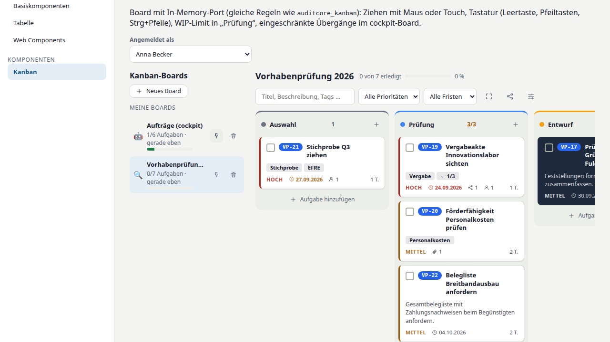

# Kanban-Oberfläche (`@flowaudit/ui`, `@flowaudit/ui-react`)

Die Oberfläche arbeitet ausschließlich über einen **Port** (`BoardPort` aus
`@flowaudit/kanban-core`): `MemoryBoardPort` (Demo, Tests, lokale Bearbeitung)
oder `RestBoardPort` (REST-Vertrag [`rest-api.md`](rest-api.md)). Regeln
(Übergänge, WIP, Rechte, Rang) wendet sie mit der Kernlogik sofort an
(optimistisch) und übernimmt danach den Stand des Ports; Ablehnungen rollen
zurück, ein `VERSION_CONFLICT` lädt neu.

## `KanbanBoard` / `<flowaudit-kanban-board>`

| Prop / Eigenschaft | Typ | Bedeutung |
|---|---|---|
| `port` | `BoardPort \| null` | Speicher- und Rechte-Port |
| `boardId` | `string` | Board im Port |
| `board`, `userId` | `Board`, `string` | ohne Port: lokale Bearbeitung (In-Memory) |
| `users` | `UserRef[]` | Namen für Freigaben |
| `readOnly` | `boolean` | sperrt alle Schreibaktionen zusätzlich zu den Rechten |
| `sharedByName` | `string` | Anzeige im Nur-Lesen-Banner |
| `showFullscreen` | `boolean` | Vollbild-Schaltfläche (Ereignis `fullscreen`) |
| `today` | `YYYY-MM-DD` | Bezugstag für Fristen (Standard: heute) |
| `locale` | `de \| en` | Sprache (Standard: bereitgestellte Sprache) |

Ereignisse: `board-change` (neues Board nach jeder gespeicherten Änderung),
`error` (`KanbanError` mit `code`), `fullscreen`, `navigate` (`CardLink`, Karte –
z. B. Notizbuch-Seite öffnen), `attachment` (Anhang, Karte), `card-open`.
Slot `card-extra` (Vue): eigene Abschnitte in der Detailansicht (z. B. KI-Prompt).

## `KanbanBoardList` / `<flowaudit-kanban-boards>`

Props `port`, `activeId`, `locale`; Ereignisse `board-select`, `created`.
Eigene und geteilte Boards, Fortschritt, relative Zeit, Anheften, Löschen mit
Bestätigung, Anlegen aus den Vorlagen.

## React

`FlowauditKanbanBoard` (`onBoardChange`, `onError`, `onFullscreen`,
`onNavigate`, `onAttachment`, `onCardOpen`) und `FlowauditKanbanBoards`
(`onBoardSelect`, `onCreated`); Objekte werden als Eigenschaften gesetzt.

## Bedienung und Barrierefreiheit

- **Maus/Stift/Touch:** Ziehen über Pointer Events (eigene Umsetzung, keine
  Fremdbibliothek); Vorschau an der Zielposition, unerlaubte Ziele zeigen
  keine Vorschau; Escape bricht ab. Geprüft und verworfen: vuedraggable/
  SortableJS (MIT) – DOM-Umordnung kollidiert mit rangbasiertem Rendern und
  Veto durch Übergangs-/WIP-Regeln.
- **Tastatur:** Karte fokussieren, Leertaste nimmt auf, Pfeiltasten
  verschieben (nur in erlaubte Spalten), Leertaste/Enter legt ab, Escape
  bricht ab; Strg+Pfeile verschieben direkt (cockpit); Enter öffnet Details;
  Board: `N` neue Karte, `F` Vollbild, `/` Suche.
- **ARIA:** Spalten als beschriftete Listen, Karten mit
  `aria-roledescription`, Anleitung per `aria-describedby`, Ansagen in einer
  `aria-live`-Region, Fortschritt als `progressbar`, Dialoge modal mit
  Fokusfalle.
- **Gestaltung:** nur Designtoken `--fa-*` (hell/dunkel), eigene Variablen
  `--fa-kanban-*`, `prefers-reduced-motion` beachtet.

