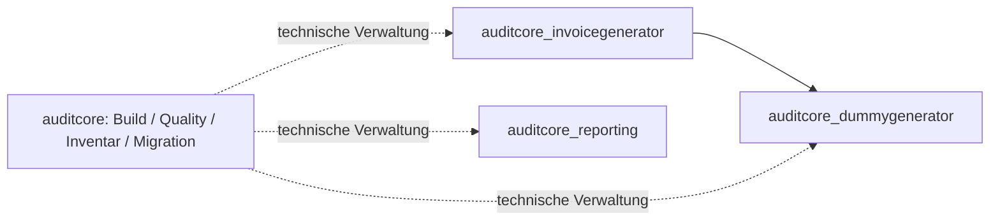

# AUDITCORE PLATFORM BUILD REPORT — Fachpakete, Phase C

Stand: 22. September 2026. Repository: `janpow77/auditcore`.
Geprüfter und gepushter Implementierungscommit:
`8b11933957e6e311321c53ce37e7544e62768dbb`.
Beide abschließenden CI-Workflows bestehen auf Python 3.11, 3.12 und 3.13.
Lokale Dateiverweise unter `.auditcore/` bezeichnen Prüfartefakte im Arbeitsbereich;
öffentliche Nachweise und Downloadadressen sind separat verlinkt.

**Bibliotheks-Preview veröffentlicht und öffentlich installierbar.** Drei echte
Fachbibliotheken sind unter MIT als Wheels, Source-Distributionen und signierte
Debian-Pakete verfügbar. Selektive pip-Installation, automatische Abhängigkeiten,
Funktionstests und APT-Installation/Entfernung wurden anonym gegen den
öffentlichen GitHub-Feed erfolgreich geprüft. Lokaler Debian-Upgrade-Test PASS.
**Gesamtabnahme aller Anwendungen: REVIEW_REQUIRED.** Keine reale Anwendung ist
vollständig migriert oder zur Produktion freigegeben; konkrete Blocker stehen unten.

## Architektur und Komponenten

Die ausdrückliche spätere Nutzerentscheidung in
[ADR-001](../architecture/ADR-001-multi-package-monorepo.md) ersetzt die frühere
Ein-Projekt-Vorgabe durch ein Repository mit separat installierbaren
Fachdistributionen. Anwendungen bleiben in ihren eigenen Repositories.
Die Plattform wird nicht automatisch zur Laufzeitabhängigkeit der Fachpakete.
Der [Frameworkbericht](FRAMEWORK_PHASES_1_2.md) und der historische
[Plattformbericht](PLATFORM_BUILD_REPORT.md) behalten ihren jeweiligen Zeitbezug.

| Komponente | Nachweisbarer Stand |
|---|---|
| auditcore | Installierbare Plattform mit gemeinsamem Releaseverfahren; bestehende `auditcore.reporting`-Kompatibilitäts-API bleibt erhalten. |
| quality | Tatsächlich ausgeführte Syntax-, Architektur-, Typ-, Dokumentations-, Secret-/Privacy-, Dependency-, Komplexitäts-, API-, Regressions-, Supply-Chain- und Policy-Gates; offene Einzelprüfungen bleiben sichtbar. |
| Framework Policy Integration | Quellengebundener Provider für MUSS/BEDINGT/SOLL; Artefakt-, Quell-, Kontext- und Frameworkbindung von Nachweisen. |
| Applicability Evaluation | Dreistufige Logik; UNKNOWN wird nicht false. Dokumentenspeicher und konkrete Exportformate präzisieren T-08/T-10. |
| consolidator | Persistentes Mehrpaket-Inventar, APIs, Dependencies, Provenienz, Consumer und Sourcehashes; konservative fachliche Kandidatenauswahl. |
| apprefactor | Konkrete Pläne, Characterization, Import-/Dependency-Änderungen, Wrapper und Rollback; reale Consumer werden bei fehlenden Freigaben blockiert. |
| deployer | Wheel/sdist, CycloneDX-SBOM, Buildmanifest, Debian-Bibliothekspakete, lokale pip-Quelle und signierte APT-Indizes mit echten Installationsprüfungen. |

Die Plattform-CI des vorherigen Commits `ae737e2` besteht auf Python 3.11, 3.12 und 3.13:
[Quality-Lauf 35758621384](https://github.com/janpow77/auditcore/actions/runs/35758621384).
Die erfolgreichen Schritte umfassen Editable-Installation mit Dev-Extras,
pytest, `ruff check .`, `mypy src`, CLI-Hilfen, Build, Bandit und pip-audit.
Die Selfcheck-Befehle sind ausgeführt; ihr Exitcode ersetzt nicht den
fachlichen JSON-Gesamtstatus oder eine Anwendungsfreigabe.
Der neue [Plattformlauf 35759298449](https://github.com/janpow77/auditcore/actions/runs/35759298449)
für `71aceb94` besteht ebenfalls auf Python 3.11, 3.12 und 3.13. Der
Hauptprüflauf meldet lokal 253 bestandene Plattformtests.

## Libraries / Modules created und Provenienz

| Distribution / Importpaket | Version | Fachlicher Umfang | Laufzeitabhängigkeiten |
|---|---|---|---|
| `auditcore_dummygenerator` | 0.1.0 | Synthetische Datensätze, 27 dokumentierte Feld-/Generatorprofile, deterministische Steuerung und begrenzte Batch-Verarbeitung | Keine obligatorischen |
| `auditcore_invoicegenerator` | 0.1.0 | Charakterisiertes Flowinvoice-Demoprofil, getrennte neue Rechnungsszenarien, typisierte Records und JSON-Ausgabe | `auditcore_dummygenerator==0.1.0` |
| `auditcore_reporting` | 0.1.0 | Charakterisierte Flowlib-Zahlenformatwahl `get_number_format` | Keine |

Die normalisierten pip-Distributionsnamen verwenden Bindestriche, die
Python-Importnamen Unterstriche. Debian-Namen sind jeweils
`python3-auditcore-dummygenerator`, `python3-auditcore-invoicegenerator` und
`python3-auditcore-reporting`.

Die gestrichelten Beziehungen sind Werkzeugeinsatz, keine Runtime-Dependencies.
Die selektiven Installationstests bestätigen: Reporting installiert nur
Reporting, Dummy nur Dummy, Invoice genau Invoice und Dummy.

| Paket | Tatsächliche GitHub-Codequelle | Lizenzgrundlage |
|---|---|---|
| Dummy | `janpow77/flowaudit_testdatengenerator_frontend@05bc5ac560dfff3bc7181323240745215492d09a`, `backend/generator.py` | Ausdrückliche MIT-Freigabe des berechtigten Nutzers am 22.09.2026 für diesen extrahierten Kern. |
| Invoice | `janpow77/flowinvoice@fb2d18568d2eaf64574d131ceae51a936b9aac02`, `docs/demo_data/generate_demo_invoices.py` | Dieselbe ausdrückliche Freigabe, auf den bezeichneten Kern begrenzt. |
| Reporting | `janpow77/flowlib@aca2dc6aad25aea0720312dbcc6da00b0bcba330`, `python/flowlib/excel/formats.py` | Tatsächlich vorhandene MIT-Lizenz; Originalhinweis erhalten, Referenz `LICENSES/flowlib-MIT.txt`. |

Alle Pakete enthalten Lizenz, README, Provenienz, Kontext und Tests. Die frühere
Lizenzlage UNKNOWN bei Dummy und Invoice bleibt als historische Beobachtung
in der Provenienz erhalten; sie wurde durch eine ausdrückliche Rechtefreigabe
ergänzt. Daraus folgt keine pauschale Umlizenzierung anderer privater Quellen.
Insbesondere wurde kein Portal-Rechnungskern oder abweichendes JKB-Formatprofil
ungeprüft übernommen. Fachprofile bleiben dort DRAFT, wo noch keine fachliche
Freigabe dokumentiert ist; MIT ist keine fachliche oder produktive Freigabe.

## pytest, Ruff, Mypy und Quality

| Paket | Lokale tatsächlich ausgeführte Tests, Python 3.12 | Ruff / Mypy | Voller Quality-Bericht |
|---|---|---|---|
| Dummy | 79 Tests; zusätzlich 58 Original-Characterization-Fälle | PASS / PASS | WARNING: zwei Komplexitätswarnungen, übrige Gates PASS |
| Invoice | 249 Tests nach Laufzeitkorrektur; 180 Characterization-Fälle im Testumfang | PASS / PASS | PASS, alle neun Gates; 249 Tests jetzt tatsächlich im Regressionsgate ausgeführt |
| Reporting | 35 Tests einschließlich Architekturtest; 34 Original-Characterization-Fälle | PASS / PASS | PASS, alle neun Gates |

Die Characterization-Zahlen sind keine zusätzlich zu den Unit-Tests addierbare
Gesamtzahl. Frühere Invoice-Prüfläufe mit 245 Tests bleiben frühere Stände;
der dokumentierte installierte Python-3.12-Vorlauf umfasst 248. Die aktuelle
Fachpaket-CI prüft 249 nach Ergänzung der Laufzeitregression.

Nachweise:

- `.auditcore/dummy-validation/quality-mit-final-report.json` und die zugehörigen
  tatsächlichen Original-Replays; API-Vergleich gegen den Extraktionssnapshot PASS.
- `packages/auditcore_invoicegenerator/.auditcore/quality-final.json`;
  `.auditcore/invoice-evidence/result.json` dokumentiert frühere separat ausgeführte
  installierte Regressionstests. Nach Ergänzung des expliziten Prüfbefehls wurde
  das vollständige Quality-Gate tatsächlich erneut ausgeführt: alle neun Gates
  PASS einschließlich 249 Tests; keine Umdeutung eines historischen Protokolls.
- `.auditcore/reporting-quality-final.json`,
  `.auditcore/reporting-framework-t38-final.json`; Vergleich gegen die erhaltene
  Flowlib-/Plattform-Format-API PASS.

Dummy-Warnungen werden bewusst beibehalten: `AC-COMP-001` am Konstruktor betrifft
fünf Parameter einschließlich `self` für den expliziten Seed-/Datum-/Backendvertrag;
die zweite Warnung betrifft den bestehenden `generate_field`-Dispatcher mit
Komplexität 24. Es erfolgte keine fachliche Umgestaltung allein zur Entfernung
dieser Warnungen.

### CI-Fehler und nachgewiesene Korrektur

Der [erste Fachpaket-Lauf 35758621400](https://github.com/janpow77/auditcore/actions/runs/35758621400)
für `ae737e2` bestand auf Python 3.12/3.13; unter 3.11 bestanden Build und
Installation, anschließend scheiterten 18 Invoice-Golden-Vergleiche.
Der Unterschied lag in der nativen Float-Summierung und den exakten
Referenzausgaben zwischen den Laufzeiten.

Die Korrektur in `71aceb94` zeichnet das tatsächlich ausgeführte unveränderte
Original für Python 3.11 als eigenen Referenzsatz auf. Keine fachliche Summe
im Laufzeitcode wurde dafür angepasst; keine pauschale Vergleichstoleranz
versteckt Abweichungen. Ein zusätzlicher Test sichert die Laufzeitzuordnung.
Der [neue Fachpaket-Lauf 35759298556](https://github.com/janpow77/auditcore/actions/runs/35759298556)
besteht auf **Python 3.11, 3.12 und 3.13**, einschließlich aller 249 Invoice-Tests
und unter 3.12 der vollständigen Debian-/APT-Prüfung.

## Framework Policy Integration und Applicable Framework Tests

Verbindliche Quelle bleibt `janpow77/verwaltung-app-framework`, Commit
`15f5338f783f2c7d5760a9bb299be06d27326be0`. MUSS verlangt Bearbeitung,
BEDINGT eine tatsächliche Auslöserprüfung, SOLL beschreibt Empfehlungen.
Profile werden abgeleitet und ersetzen diese Quelle nicht.

Die neue Kontextpräzisierung verlangt für T-08 Dokumente **und** Speicherung,
für T-10 Exporte **und** Tabellen-/Archivformate. Invoice hat belegbar keinen
Dokumentenspeicher und exportiert JSON. Damit sind diese beiden konkreten Tests
`NOT_APPLICABLE_WITH_REASON`; T-09 bleibt für den Export anwendbar. Unbekannte
neue Felder führen bei vorhandenen Dokumenten/Exporten zu `REVIEW_REQUIRED`.
F-07 und T-14 wurden nicht abgeschwächt. Die 97 gezielten Policy-/Quality-
Regressionstests sowie Ruff und Mypy für den Provider bestanden tatsächlich.
[Details und Nachweisbindung](../policy/framework-remediation.md).

| Paket | Aktueller Policy-Status | Anwendbare Katalogtests laut Provider |
|---|---|---|
| Dummy | PASS im begrenzten Library-Kontext; F-09/F-15 gebunden | T-14, T-37, T-38 |
| Invoice | PASS im begrenzten Library-Kontext; F-04/F-09/F-15 gebunden | T-09, T-14, T-37, T-38 |
| Reporting | PASS im begrenzten Library-Kontext; F-09 gebunden | T-14, T-37, T-38 |

Die rohen Provider-Testzeilen sind eine Anwendbarkeitsauswahl und behalten bis
zu ihrer getrennten Ausführung `NOT_EXECUTED`. Aus einer positiven
Anforderungsbewertung wird kein erfundener Katalogtestlauf abgeleitet.
Reporting-T-38 wurde tatsächlich am frisch installierten Wheel ausgeführt und
die installierten Modulbytes gegen den aktuellen Quellbaum geprüft. Invoice
hält seine tatsächlichen Export-/Architektur-/Supply-Chain-Nachweise separat
in `.auditcore/policy-proof.json` und `.auditcore/supplychain-proof.json` des
Pakets fest. Die Kontexte gelten nicht automatisch für Consumer-Anwendungen.

## apprefactor, Applications migrated, Applications optimized

**Applications migrated: 0. Applications optimized: 0.** Reale Anwendungen
bleiben `MIGRATION_BLOCKED` beziehungsweise ihre Quellmigration `NOT_EXECUTED`.
Die bereits geleisteten technischen Nachweise sind enger:

| Consumer | Tatsächlich geprüft | Verbleibende Grenze |
|---|---|---|
| Dummy-Frontend, `backend/main.py` | Isolierter vorgeschlagener Import und Aufrufe für JSON, CSV, XML und TXT bestanden. | F-07-/Schutzbedarfsklärung und Betriebsnachweise offen; außerdem reproduzierte CSV-Formelweitergabe (`=1+1`) als F-04-Befund. Keine produktive Umstellung. |
| Flowinvoice-Demoskript | Echte Consumer-Aufrufe im Speicher auf installiertes Profil umgeleitet: drei Läufe mit Seeds 0/42/123, jeweils 500 Rechnungen und vollständigem Gleichheitsvergleich PASS. | Keine Anwendungsdatei geändert; keine vollständige Flowinvoice-/Portal-Kompatibilität oder App-Freigabe behauptet. |
| Flowlib, `python/flowlib/excel/report.py` | Zwei reale Baseline-Tests einschließlich Workbook-Ausgabe sowie 34 Originalfälle PASS; konkreter Migrationsplan und Dry Run vorhanden. | Tatsächlicher AppRefactor-Aufruf blockiert vor Änderungen wegen offener Policy; zusätzlich bestehende Ruff-/Mypy-/Dependency-Befunde. |

Beim Dummy-Consumer bleibt `=1+1` aus einem frei vorgegebenen gewichteten
Listenwert im CSV-Export unverändert erhalten. Nachweis:
`.auditcore/dummy-validation/consumer-csv-formula-check.json`. Das ist ein realer
Exportbefund, kein behaupteter Excel-Ausführungstest; die Anwendungsmigration
bleibt blockiert. Die reine In-Memory-Bibliothek exportiert selbst kein CSV.

Bei Flowlib wurde im isolierten Checkout das fehlende Python-README für die
Installation ergänzt. Die Gesamtbaseline zeigt 15 Ruff-Befunde, 18 Mypy-Fehler
und den bereits bestehenden `ecdsa 0.19.2`-Befund `PYSEC-2026-1325` ohne im Audit
genannte korrigierte Version. Das wurde weder dem Reporting-Paket zugerechnet
noch durch Ausschluss der Authentifizierung verdeckt.

Regression Tests und Integration Tests sind damit teilweise real und erfolgreich;
eine komplette Anwendungsmigration mit allen zehn vorgeschriebenen
Verifikationskategorien ist für diese drei Consumer nicht abgeschlossen.
Keiner erhielt `READY_FOR_DEPLOYMENT`.

## Debian Package Support und Package Installation Tests

Der aktuelle lokale Gesamtnachweis
`.auditcore/domain-packages-published/result.json` hat **PASS**:

- Wheel-/sdist-Builds, Manifest und SBOM für alle drei Pakete;
- Installation über eine tatsächlich erzeugte Python-Paketquelle und
  Requirements, `pip check`, Import aus `site-packages`, echte Funktionsaufrufe;
- getrennte selektive Installation jedes Pakets mit genau den benötigten
  Abhängigkeiten, danach Entfernung und bestätigte Nichtimportierbarkeit;
- Debian-Build, signierte APT-Indizes, Installation, Funktionsprüfung,
  Upgrade von Debian-Revision 1 auf 2 und Entfernung im isolierten Container.

Das Upgrade verwendet dasselbe geprüfte Upstream-Wheel und unterschiedliche
Debian-Paketrevisionen. Es behauptet keine neue Fachversion oder fachliche
Datenmigration. Der lokale Testsignaturschlüssel ist keine produktive
Signaturinfrastruktur. Zielinstallation benötigt keine Compiler, npm, Poetry,
uv oder PyPI-Downloads. Bibliotheken benötigen keinen systemd-Dienst;
Servicekonto-/Healthcheck-/Backup-Freigaben einer realen Anwendung werden
dadurch nicht vorweggenommen.

Wheel-SHA256 des geprüften lokalen Gesamtlaufs:

| Paket | SHA256 |
|---|---|
| Dummy | `43823f2d6a58077bef40106f2c5ac401ee66e86d7f58d4b4a16f5d6e7ac68d51` |
| Invoice | `2eab440111619270af381cf9fb7f184e43aa9f3dba74d6e3aefd2cf5d7b3b14f` |
| Reporting | `e3e6f3f2c32dd183a7f6c6e54e8600c9ad6eca658c320a5138c2ee1b2e9735a0` |

Öffentliche Veröffentlichung: **PASS**, [Preview v0.1.0](https://github.com/janpow77/auditcore/releases/tag/v0.1.0),
27 Assets, Tag auf Implementierungscommit `8b119339`. Anonyme öffentliche
Installation: **PASS** — selektives Invoice-Requirement lädt automatisch Dummy,
Reporting und Plattform bleiben dabei uninstalliert. Danach bestehen auch die
Hash-gebundene Installation aller drei Wheels und ihre tatsächlichen Funktionsprüfungen.
APT lädt über die signierte öffentliche Quelle einschließlich GitHub-Redirects;
Installation, Funktionen und Entfernung bestehen im separaten Debian-Container.
[Maschinenlesbarer öffentlicher Installationsnachweis](domain-public-installation.json),
[Anleitung mit Requirements und APT](../deployment/package-feed.md).
Schlüsselfingerprint: `E427F95CC37CBFD0876314CA0D1580A6CAE37327`.
Kein PyPI-Upload und keine Freigabe einer Anwendung werden behauptet.
Der veröffentlichte Vorbereitungsmanifest behält absichtlich seine historischen
NOT_EXECUTED-Felder für Upload und öffentliche Installation.

## GitHub Inventory, KIRA, Graphify und Library Candidates

GitHub bleibt Codequelle, KIRA Wissensquelle, Graphify Strukturanalyse.
Die historische globale Inventur erfasste **71 Repositories**, 84.752 Symbole
und 549.649 Dependency-/Call-Beziehungen. Gesamtstatus PARTIAL wegen zwei
vorhandener Python-Parsefehler; 63 strukturell vollständige Repositories,
zwei Teilinventare und sechs leere Repositories. Es wird kein neuer globaler
Scan auf Grundlage allein dieser Paketphase behauptet.

Die persistente Paketverwaltung erfasst Root-Plattform plus die drei separaten
Projekte, Metadaten, APIs, Requirements, interne Dependency-Kanten,
Provenienz und Anwendbarkeit. Sourcehash- und revisionsgebundene Snapshots
zeigen veraltete Stände als STALE. Der finale Snapshot für Releasecommit `8b119339`:
`8b0aa68613bea7c6b435c8f516fd61f57fec48e6e01886aa362589b38944429e`.
Nachweis `.auditcore/domain-package-workspace-8b119339.json`.
Spätere Quelländerungen benötigen eine erneute Bindung.

KIRA ist konfiguriert. Der historische globale Repository-/Symbolsync bleibt
PARTIAL; Timeouts, Inhaltsfilter und unpassende semantische Deduplizierung
wurden nicht als Bestätigung gewertet. Der separate finale Paket-Sync für
`8b119339` ist **PASS: drei aktualisierte Paketdokumente vollständig,
eindeutig und bytegenau mit vollständiger Pagination zurückgelesen; null Fehler
und null offene Writes**. Er enthält MIT-Provenienz, APIs, Consumer, aktuelle
Quality-/Policy-Status sowie tatsächlich verifizierte öffentliche Preview,
27 Assets, öffentliche Installationsbelege und beide erfolgreichen CI-Läufe.
Nachweise `.auditcore/domain-kira-sync-8b119339.json`,
`.auditcore/domain-kira-documents-8b119339.json` und
`.auditcore/domain-kira-public-release-evidence-8b119339.json`.
Es wurden strukturierte Metadaten statt privater Rohquellen übertragen.
Dies vervollständigt nicht den historischen globalen Repository-/Symbolsync.

Graphify wurde zusätzlich zu den historischen fünf Repositoryanalysen für die
drei tatsächlichen Fachpaket-Laufzeitmodule ausgeführt:

| Paket | Knoten | Kanten | Status |
|---|---:|---:|---|
| auditcore_dummygenerator | 76 | 117 | PASS |
| auditcore_invoicegenerator | 75 | 116 | PASS |
| auditcore_reporting | 7 | 5 | PASS |

Nachweise: `.auditcore/<paketname>-graphify.json`, vollständige Graphen unter
`.auditcore/domain-graphify/graphify/<paketname>/graphify-out/graph.json`.
Der analysierte Laufzeitcode blieb bei der späteren Testreferenzkorrektur
unverändert. Dynamische Aufrufe werden dadurch nicht vollständig auflösbar;
lokale AST-/Dependency-Analysen und API-Snapshots ergänzen diese Nachweise.

Die historischen 2.438 Rohkandidaten sind keine freigegebenen Pakete.
Konservative Filter schließen Tests, Migrationen, generierten Code und
Framework-/Datenbankinfrastruktur als automatische Fachkandidaten aus.
Gemeinsame Abstammung ist kein unabhängiger Consumer. Der
[Domain-Paketplan](../architecture/DOMAIN_PACKAGE_PLAN.md) dokumentiert
Quellsymbole, Consumer und weitere Grenzen. Tatsächlich umgesetzt wurden
die drei oben beschriebenen Pakete; abweichende JKB-Formatregeln und
unterschiedliche Stichproben-/Risikoregeln wurden nicht harmonisiert.

## Policy Review Required, Human Decisions Required, Open Blockers

1. Fachpaket- und Plattform-CI für `71aceb94` sind nach der Python-3.11-Korrektur
   auf allen drei Laufzeiten PASS. Die abschließenden Läufe für `8b119339`
   bestehen ebenfalls auf allen drei Laufzeiten:
   [Domain-CI 35759594684](https://github.com/janpow77/auditcore/actions/runs/35759594684),
   [Plattform-CI 35759594642](https://github.com/janpow77/auditcore/actions/runs/35759594642).
2. Der zuvor fehlende Invoice-Regressionsbefehl ist ergänzt und das vollständige
   Gate mit 249 Tests tatsächlich ausgeführt: alle neun Quality-Gates PASS.
   Dieser Punkt ist technisch behoben und kein verbleibender Blocker.
3. Reale Consumer benötigen eigene Schutzbedarfs-/Policy-Entscheidungen,
   vollständige Regression und Integration. Library-PASS ist keine Übertragung
   dieser Entscheidungen und kein Deployment-Handoff.
4. Fachprofile mit offenem Review bleiben DRAFT. Unterschiedliche fachliche
   Methoden, Schwellen oder Sicherheitsgrenzen benötigen eine menschliche
   Entscheidung; keine automatische Vereinheitlichung.
5. Öffentliche Paketbereitstellung und anonyme pip-/APT-Installation sind
   tatsächlich bestanden. Auch der aktuelle Paket-KIRA-Sync ist PASS.
   Der ältere globale KIRA-Sync bleibt unabhängig davon unvollständig.

Die Rechtefreigabe für die beiden bezeichneten privaten Kerne ist hingegen
erfolgt und wird nicht weiter als offener Blocker geführt. Die verbleibenden
Blockaden verhindern keine lokale technische Nutzung der geprüften Pakete,
wohl aber die Behauptung einer vollständig abgeschlossenen Anwendungs- und
Produktivabnahme des gesamten Lastenhefts.
