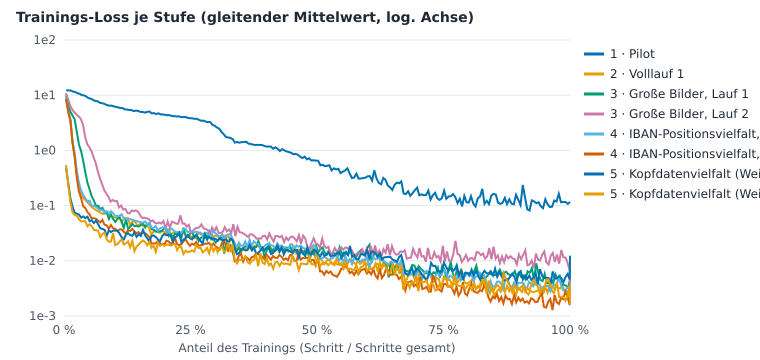
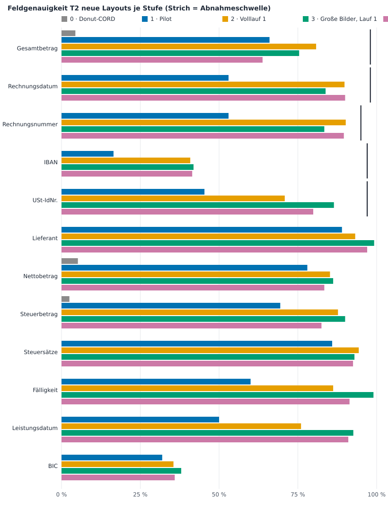

# Donut-Training: Verlauf der Ergebnisse

Stand 2026-10-08 · erzeugt mit `tools/donut_verlauf.py` aus den Läufen auf dem GPU-Rechner (Kennzahlen: `docs/donut-verlauf/kennzahlen.json`). Hintergrund, Datensätze und Aufrufe: [training.md](training.md).

## Vergleichbarkeit

- **Stufe 0** ist das unveränderte Donut-CORD-Modell (`naver-clova-ix/donut-cord-v2`); es kennt das Rechnungsschema nicht und dient nur als Nullpunkt.
- **Pilot** und **Volllauf** wurden auf **unterschiedlichen Testsätzen** bewertet: der Pilot auf den Testsätzen des Pilot-Datensatzes (T1 163 / T2 100 Belege), alle späteren Stufen auf denen des Vollsatzes (T1 1 121 / T2 500 Belege). Beide stammen aus demselben Generator, sind aber verschiedene Belege; Unterschiede von wenigen Prozentpunkten zwischen Pilot und Volllauf sind deshalb nicht belastbar.
- T1 = synthetische Belege aus den Trainingsvorlagen, T2 = Layouts und Schriften, die im Training nie vorkamen. Für die Praxis zählt T2.
- Abnahme (Entscheidung E6): Pflichtfelder mit Mindestgenauigkeit, zusätzlich höchstens 0,5 % Falschwerte nach Plausibilitätsprüfung je Feld. Die Bewertung (`train/evaluate.py`) läuft derzeit **ohne** Plausibilitätsprüfung; das zweite Kriterium ist deshalb nicht gemessen, geprüft wird nur die Feldgenauigkeit.

## Stufen

| Stufe | Lauf | Karte | Datensatz | Bildgröße | Batch × Akk. | Seed | Epochen | Schritte | Dauer | Loss Start → Ende |
|---|---|---|---|---|---|---|---|---|---|---|
| 0 · Donut-CORD | – | – | – | – | – | – | – | – | – | – |
| 1 · Pilot | `6cb8d70e0befc10e-0` | RTX 5070 Ti | Pilot | 1280×960 | 4 × 2 | 42 | 3 | 675 / 675 | 0,3 h | 11,64 → 0,1133 |
| 2 · Volllauf 1 | `2835be42bd3c1e1a-0` | RTX 5070 Ti | Voll | 1280×960 | 4 × 2 | 42 | 6 | 16 866 / 16 866 | 7,7 h | 11,55 → 0,0018 |
| 3 · Große Bilder, Lauf 1 | `17565fffc1110197-0` | RTX 5070 Ti | Voll | 1536×1152 | 2 × 4 | 42 | 6 | 9 000 / 9 000 | 5,2 h | 11,06 → 0,0041 |
| 3 · Große Bilder, Lauf 2 | `a476eca68cb5367f-1` | RTX 5060 Ti | Voll | 1536×1152 | 2 × 4 | 43 | 6 | 5 500 / 5 500 | 5,2 h | 11,10 → 0,0077 |
| 4 · IBAN-Positionsvielfalt, Lauf 1 | `03c8e8c2e6e423f0-0` | RTX 5070 Ti | Voll | 1280×960 | 4 × 2 | 42 | 6 | 16 368 / 16 368 | 70,8 h | 11,48 → 0,0033 |
| 4 · IBAN-Positionsvielfalt, Lauf 2 | `81c80dc8d52762ec-1` | RTX 5060 Ti | Voll | 1536×1152 | 2 × 4 | 43 | 6 | 16 368 / 16 368 | 79,5 h | 10,97 → 0,0016 |
| 5 · Kopfdatenvielfalt (Weitertraining), Lauf 1 | `39a890114fa430a0-0` | RTX 5070 Ti | Voll | 1280×960 | 4 × 2 | 42 | 3 | 8 061 / 8 061 | 3,1 h | 0,50 → 0,0056 |
| 5 · Kopfdatenvielfalt (Weitertraining), Lauf 2 | `58040121b93fafed-1` | RTX 5060 Ti | Voll | 1536×1152 | 2 × 4 | 43 | 3 | 8 061 / 8 061 | 7,5 h | 0,63 → 0,0029 |

## Kernzahlen auf den Pilot-Testsätzen (T1 163 / T2 100 Belege)

| Stufe | Belegquote T1 | Belegquote T2 | s/Seite (T2) | Abnahme T1 | Abnahme T2 |
|---|---|---|---|---|---|
| 0 · Donut-CORD | 0,0 % | 0,0 % | 0,64 | nein | nein |
| 1 · Pilot | 40,5 % | 13,0 % | 0,27 | nein | nein |

Belegquote = Anteil der Belege, bei denen **alle fünf Pflichtfelder** stimmen (Gesamtbetrag, Rechnungsdatum, Rechnungsnummer, IBAN, USt-IdNr.).

## Kernzahlen auf den Voll-Testsätzen (T1 1121 / T2 500 Belege)

| Stufe | Belegquote T1 | Belegquote T2 | s/Seite (T2) | Abnahme T1 | Abnahme T2 |
|---|---|---|---|---|---|
| 0 · Donut-CORD | 0,0 % | 0,0 % | 0,72 | nein | nein |
| 2 · Volllauf 1 | 89,9 % | 36,2 % | 0,42 | nein | nein |
| 3 · Große Bilder, Lauf 1 | 93,9 % | 41,6 % | 0,34 | nein | nein |
| 3 · Große Bilder, Lauf 2 | 92,6 % | 39,8 % | 0,34 | nein | nein |
| 4 · IBAN-Positionsvielfalt, Lauf 1 | 89,1 % | 74,2 % | 0,28 | nein | nein |
| 4 · IBAN-Positionsvielfalt, Lauf 2 | 95,1 % | 70,4 % | 0,34 | nein | nein |
| 5 · Kopfdatenvielfalt (Weitertraining), Lauf 1 | 90,9 % | 58,0 % | 0,28 | nein | nein |
| 5 · Kopfdatenvielfalt (Weitertraining), Lauf 2 | 96,2 % | 72,0 % | 0,34 | ja | nein |

Belegquote = Anteil der Belege, bei denen **alle fünf Pflichtfelder** stimmen (Gesamtbetrag, Rechnungsdatum, Rechnungsnummer, IBAN, USt-IdNr.).

## Feldgenauigkeit T2 neue Layouts

| Feld | Schwelle | 1 · Pilot¹ | 2 · Volllauf 1 | 3 · Große Bilder, Lauf 1 | 3 · Große Bilder, Lauf 2 | 4 · IBAN-Positionsvielfalt, Lauf 1 | 4 · IBAN-Positionsvielfalt, Lauf 2 | 5 · Kopfdatenvielfalt (Weitertraining), Lauf 1 | 5 · Kopfdatenvielfalt (Weitertraining), Lauf 2 |
|---|---|---|---|---|---|---|---|---|---|
| Gesamtbetrag (Pflicht) | 98 % | 66,0 % | 80,8 % | 75,4 % | 63,8 % | **99,0 %** | **99,4 %** | **98,6 %** | **99,8 %** |
| Rechnungsdatum (Pflicht) | 98 % | 53,0 % | 89,8 % | 83,8 % | 90,0 % | 97,0 % | 94,2 % | 72,4 % | 77,6 % |
| Rechnungsnummer (Pflicht) | 95 % | 53,0 % | 90,2 % | 83,4 % | 89,6 % | 94,6 % | **97,0 %** | **98,8 %** | **99,6 %** |
| IBAN (Pflicht) | 97 % | 16,5 % | 40,9 % | 41,9 % | 41,5 % | 88,1 % | 94,7 % | 89,9 % | 95,7 % |
| USt-IdNr. (Pflicht) | 97 % | 45,4 % | 70,8 % | 86,4 % | 79,9 % | 85,6 % | 75,8 % | 89,1 % | 94,9 % |
| Lieferant | – | 89,0 % | 93,2 % | 99,2 % | 97,0 % | 97,4 % | 79,8 % | 99,8 % | 99,0 % |
| Nettobetrag | – | 78,0 % | 85,2 % | 86,2 % | 83,4 % | 95,6 % | 96,8 % | 97,4 % | 98,6 % |
| Steuerbetrag | – | 69,4 % | 87,7 % | 90,0 % | 82,5 % | 94,3 % | 97,7 % | 95,2 % | 99,3 % |
| Steuersätze | – | 85,9 % | 94,3 % | 93,0 % | 92,5 % | 99,1 % | 99,8 % | 100,0 % | 100,0 % |
| Fälligkeit | – | 60,0 % | 86,2 % | 99,0 % | 91,4 % | 95,8 % | 77,0 % | 76,0 % | 83,0 % |
| Leistungsdatum | – | 50,0 % | 76,0 % | 92,6 % | 91,0 % | 93,2 % | 60,8 % | 72,8 % | 77,4 % |
| BIC | – | 32,0 % | 35,5 % | 38,0 % | 35,9 % | 79,1 % | 84,0 % | 77,4 % | 83,4 % |

Fett = Abnahmeschwelle erreicht. ¹ Pilot-Testsatz (andere, kleinere Stichprobe).

## Feldgenauigkeit T1 synthetisch

| Feld | Schwelle | 1 · Pilot¹ | 2 · Volllauf 1 | 3 · Große Bilder, Lauf 1 | 3 · Große Bilder, Lauf 2 | 4 · IBAN-Positionsvielfalt, Lauf 1 | 4 · IBAN-Positionsvielfalt, Lauf 2 | 5 · Kopfdatenvielfalt (Weitertraining), Lauf 1 | 5 · Kopfdatenvielfalt (Weitertraining), Lauf 2 |
|---|---|---|---|---|---|---|---|---|---|
| Gesamtbetrag (Pflicht) | 98 % | 72,0 % | **99,2 %** | **99,3 %** | **99,3 %** | **99,5 %** | **99,6 %** | **99,0 %** | **99,7 %** |
| Rechnungsdatum (Pflicht) | 98 % | 96,7 % | **99,6 %** | **99,7 %** | **99,7 %** | **99,5 %** | **99,8 %** | **99,5 %** | **99,8 %** |
| Rechnungsnummer (Pflicht) | 95 % | 85,3 % | **98,7 %** | **98,9 %** | **99,0 %** | **98,7 %** | **99,5 %** | **98,9 %** | **99,5 %** |
| IBAN (Pflicht) | 97 % | 50,7 % | 93,6 % | 95,8 % | 94,7 % | 92,7 % | 96,7 % | 93,6 % | **97,5 %** |
| USt-IdNr. (Pflicht) | 97 % | 85,3 % | 95,9 % | **99,0 %** | **97,9 %** | 96,3 % | **98,4 %** | **97,5 %** | **98,9 %** |
| Lieferant | – | 97,5 % | 100,0 % | 100,0 % | 100,0 % | 100,0 % | 100,0 % | 99,9 % | 100,0 % |
| Nettobetrag | – | 85,5 % | 98,8 % | 99,0 % | 99,0 % | 99,1 % | 99,7 % | 99,0 % | 99,7 % |
| Steuerbetrag | – | 72,2 % | 98,9 % | 98,7 % | 98,5 % | 98,6 % | 99,5 % | 98,9 % | 99,2 % |
| Steuersätze | – | 95,4 % | 99,7 % | 99,7 % | 99,7 % | 99,7 % | 99,7 % | 99,9 % | 99,7 % |
| Fälligkeit | – | 97,3 % | 99,4 % | 99,8 % | 99,5 % | 99,6 % | 99,8 % | 99,7 % | 99,7 % |
| Leistungsdatum | – | 97,3 % | 99,7 % | 99,7 % | 99,8 % | 99,6 % | 99,8 % | 99,5 % | 99,7 % |
| BIC | – | 74,3 % | 78,9 % | 84,3 % | 78,6 % | 80,3 % | 88,1 % | 81,4 % | 85,3 % |

Fett = Abnahmeschwelle erreicht. ¹ Pilot-Testsatz (andere, kleinere Stichprobe).

## Fehlerbild der Pflichtfelder auf T2 (5 · Kopfdatenvielfalt (Weitertraining), Lauf 2)

| Feld | erwartet | richtig | fehlt | falsch | davon erfunden |
|---|---|---|---|---|---|
| Gesamtbetrag | 500 | 499 (100 %) | 0 (0 %) | 1 (0 %) | 1 (0 %) |
| Rechnungsdatum | 500 | 388 (78 %) | 0 (0 %) | 112 (22 %) | 2 (0 %) |
| Rechnungsnummer | 500 | 498 (100 %) | 0 (0 %) | 2 (0 %) | 2 (0 %) |
| IBAN | 487 | 466 (96 %) | 0 (0 %) | 21 (4 %) | 21 (4 %) |
| USt-IdNr. | 487 | 462 (95 %) | 5 (1 %) | 20 (4 %) | 20 (4 %) |

Fehlt = kein Wert ausgegeben. Falsch = Wert ausgegeben, aber nicht der erwartete. Erfunden = ausgegebener Wert, der in keinem erwarteten Feld dieses Belegs vorkommt. Ein fehlender Wert ist für die Prüfung harmloser als ein falscher, weil er auffällt.

## Stufe 3: Läufe mit großen Bildern (1536×1152)

- 3 · Große Bilder, Lauf 1 (`17565fffc1110197-0`): bewertet, Training fertig, 9 000 von 9 000 Schritten.
- 3 · Große Bilder, Lauf 2 (`a476eca68cb5367f-1`): bewertet, Training fertig, 5 500 von 5 500 Schritten.
- 4 · IBAN-Positionsvielfalt, Lauf 2 (`81c80dc8d52762ec-1`): bewertet, Training fertig, 16 368 von 16 368 Schritten.
- 5 · Kopfdatenvielfalt (Weitertraining), Lauf 2 (`58040121b93fafed-1`): bewertet, Training fertig, 8 061 von 8 061 Schritten.
